# Item-Catalog
by Mahmoud Adel, in fulfillment of Udacity's

## Description
This project can preview all stores on the world with address, can preview
all products that already exist in a specific store, and many features when
user is logged in then he have a permission to create, edit, delete store
and product but he can delete and edit only things he was created before,
developed by `Python Flask Framework` with persistent data storage `SQLite Database`.

## Getting Started

### Prerequisites
* [Python 3](https://www.python.org/ftp/python/3.7.1/python-3.7.1.exe)
* [Git Bash Terminal](https://git-scm.com/download/win)

### Install required lib
$ `pip install flask`  
$ `pip install functools`  
$ `pip install sqlalchemy`  
$ `pip install httplib2`  
$ `pip install requests`  
$ `pip install oauth2client`  

### How To Run
instde project folder open `git bash` then write  
$ `python add_items.py`  
$ `python views.py`  

## Preview (ScreenShot)

Store Page
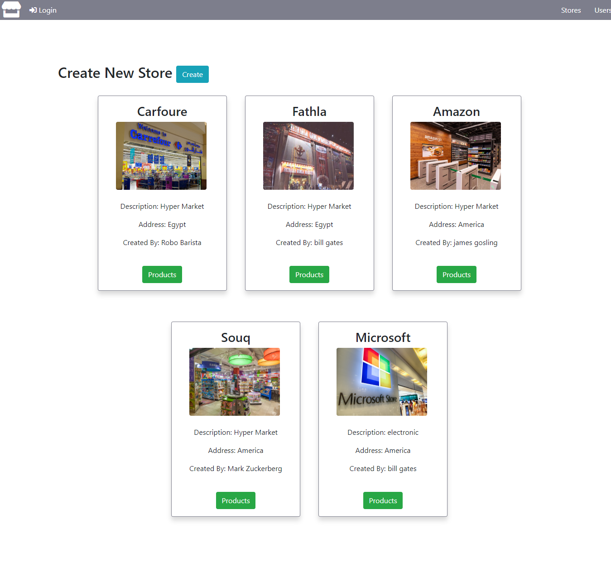

Product Page
http://localhost:8000/store/(StoreName)/products
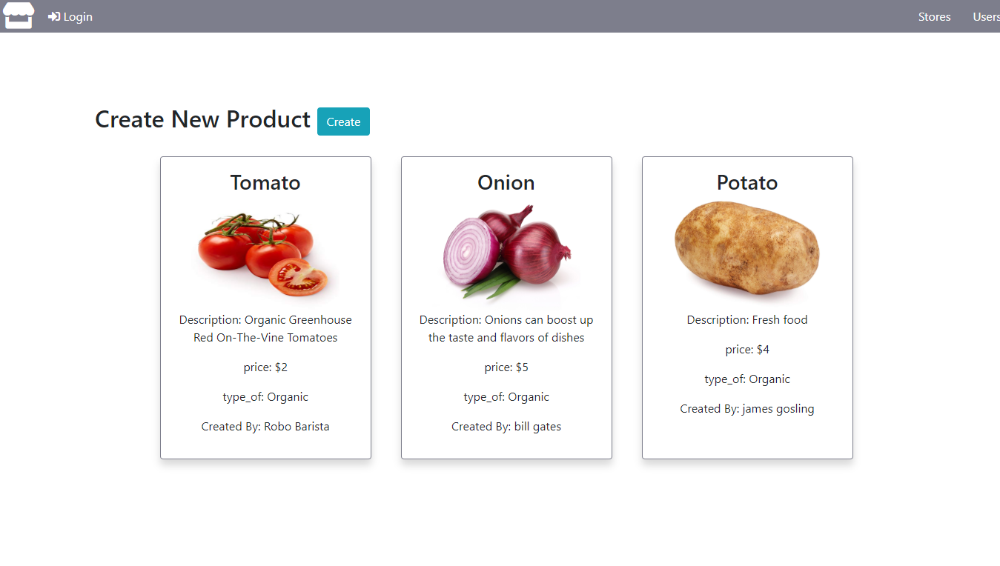

Login Page
http://localhost:8000/login
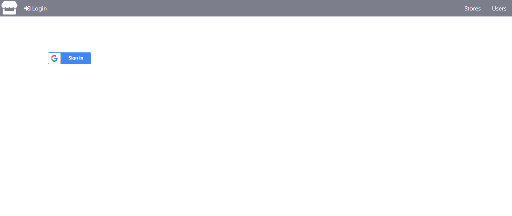

Users Page
http://localhost:8000/users

Create New Store Page
http://localhost:8000/
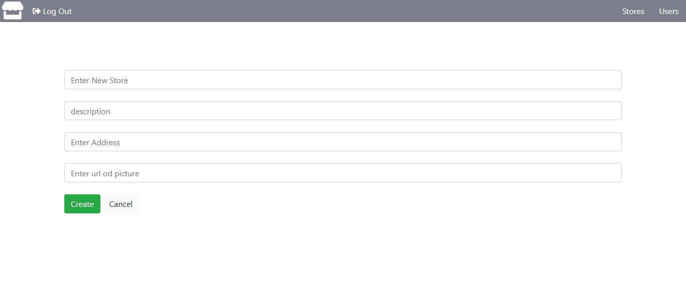

Edit Store Page
http://localhost:8000/store/(StoreName)/edit
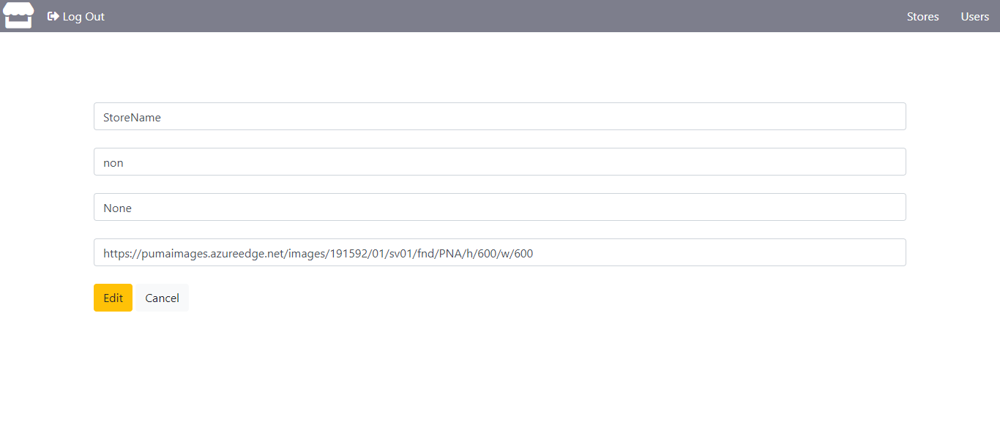

Delete Store Page
http://localhost:8000/store/(StoreName)/delete
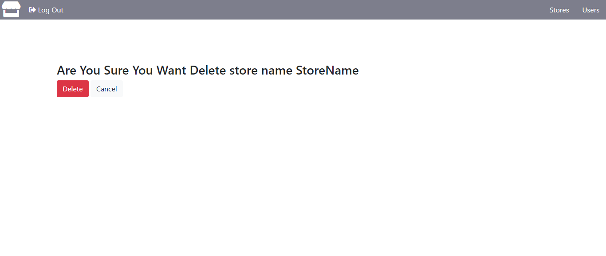

Create New product Page
http://localhost:8000/store/(StoreName)/product/new
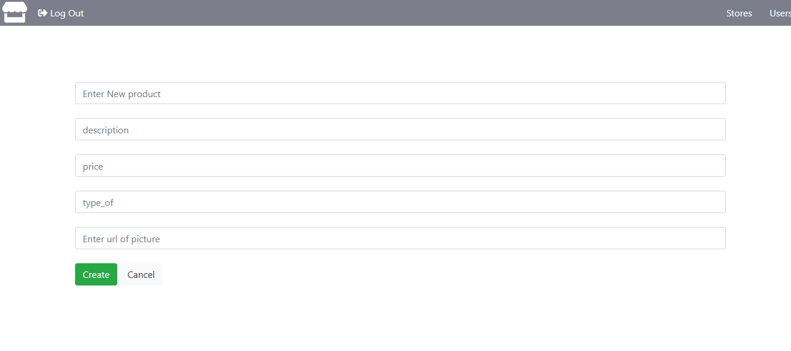

Edit product Page
http://localhost:8000/store/(StoreName)/(ProductName)/edit
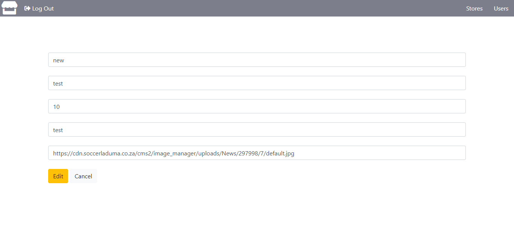

Delete product Page
http://localhost:8000/store/(StoreName)/(ProductName)/delete
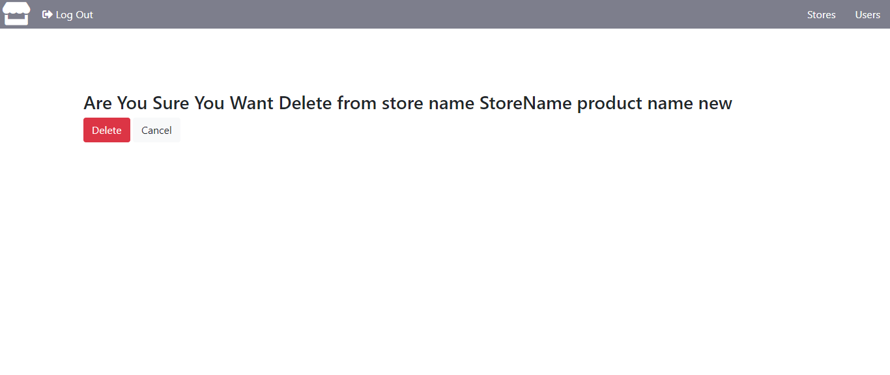

JSON Endpoint
http://localhost:8000/stores/json
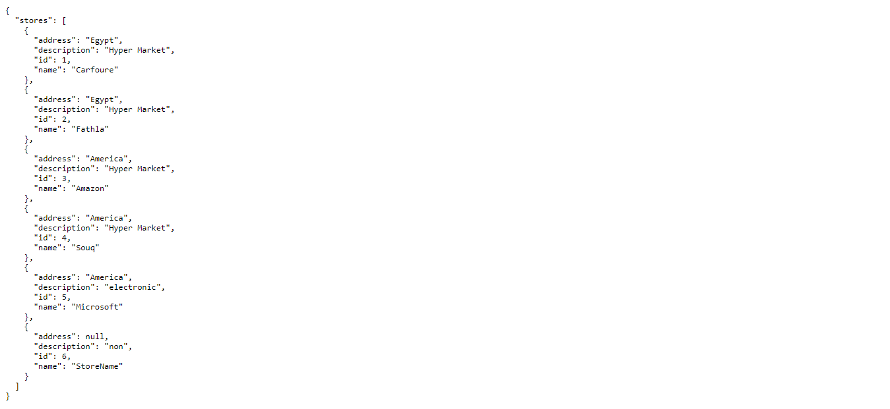

http://localhost:8000/store/Carfoure/products/json
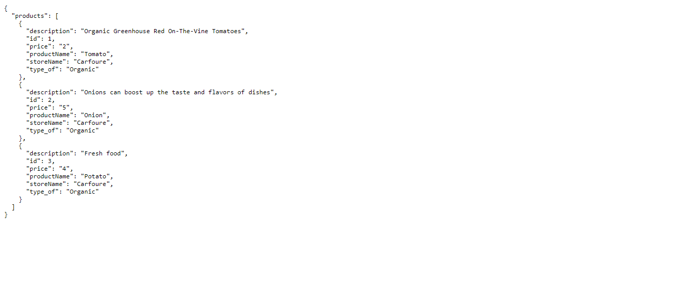

http://localhost:8000/store/Carfoure/product/Tomato/json
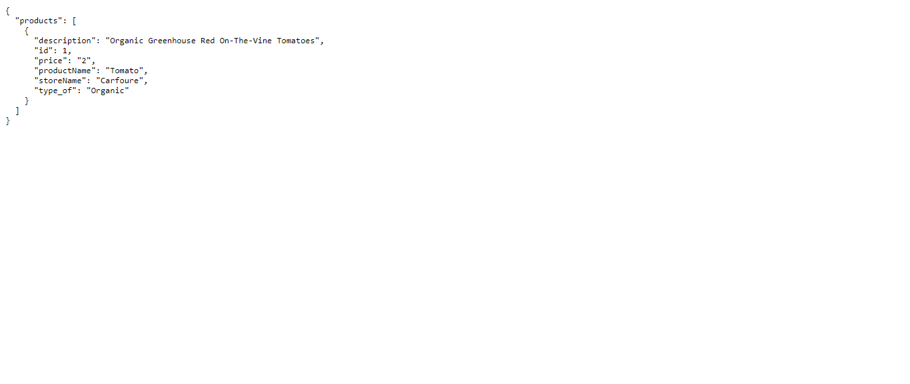
